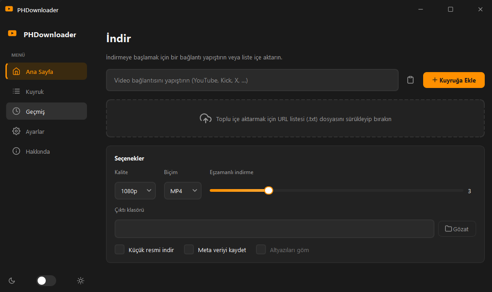
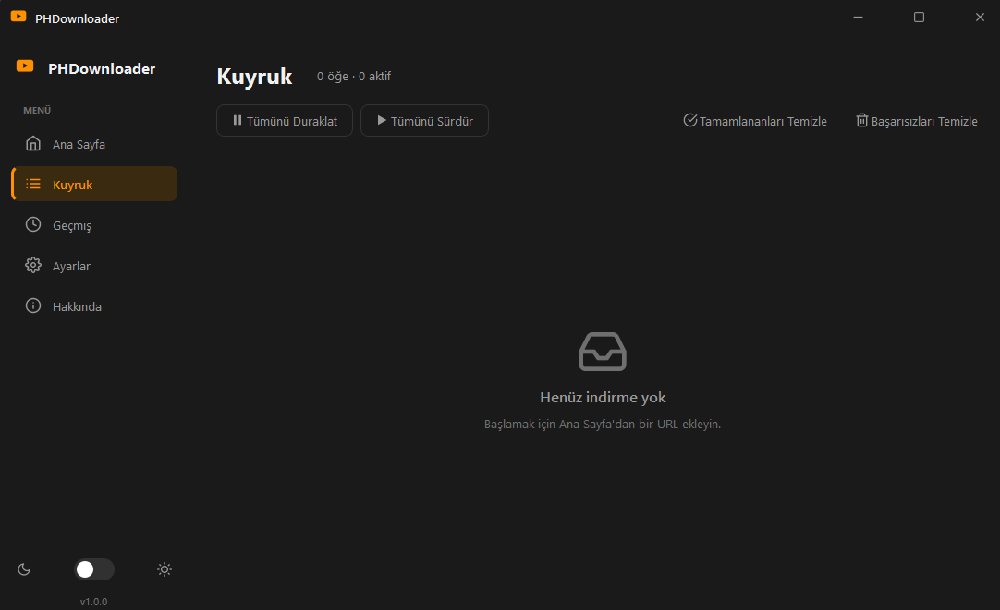
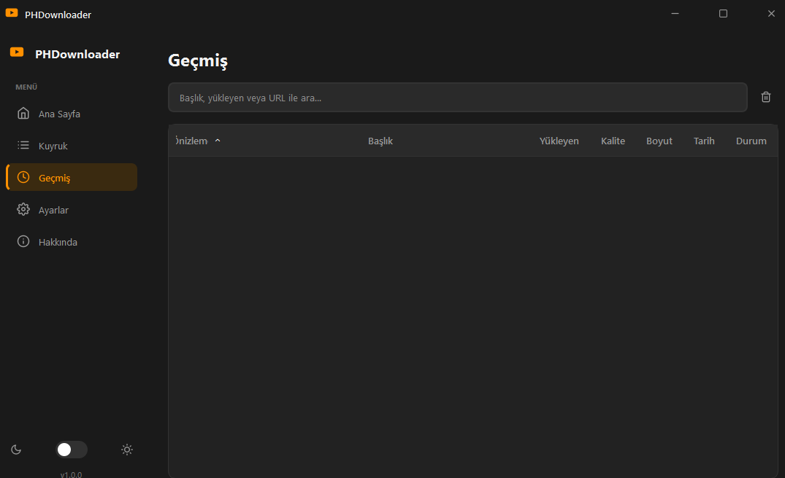
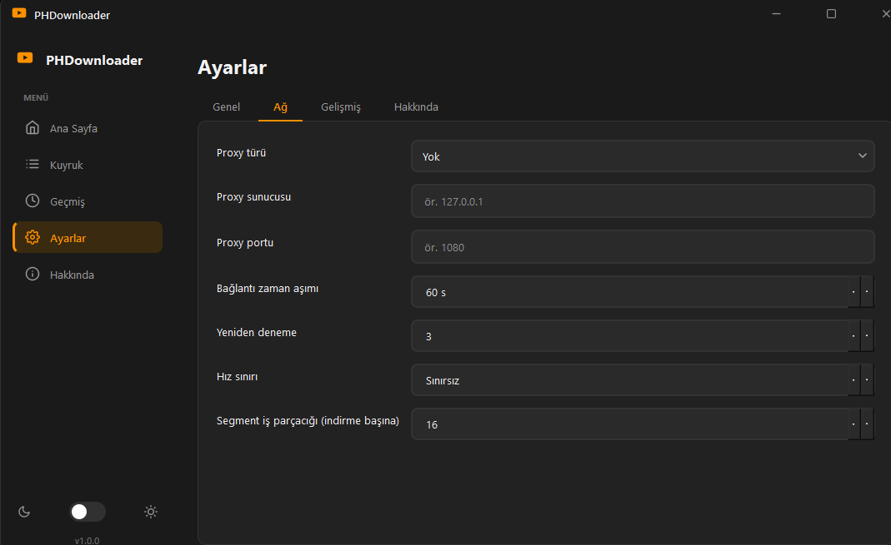

<div align="center">

# PHDownloader

**Modern, multi-site video downloader — PyQt6 desktop app + full CLI**

**English** · [**Türkçe**](README.tr.md)

Download videos from **YouTube, Twitter/X, PornHub**, and every other site supported by [yt-dlp](https://github.com/yt-dlp/yt-dlp).  
Concurrent HLS downloading, automatic ffmpeg setup, separate audio merging for high-quality streams, dark/light UI, English & Turkish.


[Features](#-features) · [Quick Start](#-quick-start) · [CLI](#-command-line) · [Build](#-build-executable) · [Troubleshooting](#-troubleshooting)

</div>

---

## ⚠️ Disclaimer

- **For personal, lawful use only.** You are solely responsible for how you use this software.
- Only download content you **own or are explicitly authorized** to download. Downloading copyrighted material without permission may be illegal in your jurisdiction.
- Respect each website's **Terms of Service**. Automated downloading may violate them.
- When accessing adult sites, you must be **18+** and comply with local laws.
- This project is **not affiliated with, endorsed by, or connected to** YouTube, X/Twitter, PornHub, or any other platform. All trademarks belong to their respective owners.
- Provided **"as is", without warranty**. See [`LICENSE`](LICENSE) for details.

---

## 📸 Screenshots

> Add screenshots to `docs/` and they will render below.

| Home | Queue | History | Settings |
| --- | --- | --- | --- |
|  |  |  |  |

---

## ✨ Features

### Desktop GUI (PyQt6)

- **Modern UI** — dark / light themes, accent orange, frameless window, custom title bar, system tray
- **Multi-site URLs** — paste a link or drag-and-drop a `.txt` batch file
- **Download queue** — concurrent downloads, pause / resume / cancel per item
- **Live cards** — thumbnail, title, uploader, quality, progress bar with speed & ETA
- **History** — SQLite database, search, re-download, open folder, copy URL
- **Settings** — quality, format, proxy, rate limit, cookies, filename template, ffmpeg path
- **Internationalization** — English & Turkish (`Settings → Language`)
- **Notifications** — desktop alerts when downloads finish
- **Non-blocking** — all downloads run on background threads; UI stays responsive

### Download engine (GUI + CLI)

- **yt-dlp extraction** for 1000+ sites (YouTube, Twitter/X, Vimeo, Twitch, etc.)
- **PornHub HTML fallback** when yt-dlp fails on PH URLs
- **Quality selection** — `best` or fixed resolution (240p → 2160p)
- **HLS (m3u8)** — concurrent segment download + ffmpeg mux
- **Direct MP4** — streaming download with **resume** support
- **Separate audio merge** — high-quality YouTube/Twitter streams (video-only + audio track) merged via ffmpeg
- **Twitter/X optimized path** — yt-dlp native `video+audio` mux for reliable sound
- **Auto ffmpeg** — detected from PATH, Scoop, Chocolatey, Program Files, or downloaded on first run (Windows)
- **Metadata sidecars** — `.info.json` + `.jpg` thumbnail
- **Retry & resilience** — exponential backoff, proxy rotation, integrity check via ffprobe
- **No-ffmpeg fallback** — unencrypted HLS saved as playable `.ts` (VLC / MPV)

---

## 🌐 Supported sites

Any site supported by **yt-dlp** works out of the box. Common examples:

| Platform | Notes |
| --- | --- |
| **YouTube** | High quality = separate video + audio; merged automatically with ffmpeg |
| **Twitter / X** | HLS video + audio; dedicated mux path for reliable sound |
| **PornHub** | yt-dlp + custom `mediaDefinitions` HTML fallback |
| **Vimeo, Twitch, Reddit, TikTok, …** | Via yt-dlp extractors |

Update yt-dlp regularly — sites change often:

```bash
pip install -U yt-dlp
```

---

## 🚀 Quick start

### Option A — Windows executable (no Python required)

1. Download **`PHDownloader.exe`** from [Releases](https://github.com/TheOrderx/PHDownloader/releases).
2. Run **`PHDownloader.exe`**.
3. On first launch, ffmpeg is downloaded automatically (bottom progress banner).
4. Paste a URL on the **Home** page → **Add to Queue**.

### Option B — Run from source

```bash
git clone https://github.com/TheOrderx/PHDownloader.git
cd PHDownloader
python launcher.py
```

`launcher.py` installs missing Python packages automatically, then starts the GUI.

### Option C — CLI only (no GUI)

```bash
pip install -r requirements.txt
python main.py -u "https://www.youtube.com/watch?v=VIDEO_ID"
```

---

## 🛠️ Build executable

```bash
python build_exe.py            # → dist/PHDownloader.exe  (single file)
python build_exe.py --onedir   # → dist/PHDownloader/     (faster startup)
```

PyInstaller is installed automatically if missing. Close any running `PHDownloader.exe` before rebuilding.

---

## 💻 Command-line

```bash
# Single URL
python main.py -u "https://www.youtube.com/watch?v=XXXX"

# Batch file (one URL per line)
python main.py -b urls.txt -q 1080 -o ./downloads -t 32

# PornHub example
python main.py -u "https://www.pornhub.com/view_video.php?viewkey=XXXX" -q best

# Without ffmpeg (saves .ts for HLS)
python main.py -u "URL" --no-ffmpeg
```

### Common flags

| Flag | Description |
| --- | --- |
| `-u, --url` | Single video URL |
| `-b, --batch` | Text file with URLs (one per line) |
| `-o, --output` | Output directory (default: `./downloads`) |
| `-q, --quality` | `best`, `2160`, `1440`, `1080`, `720`, `480`, `360`, `240` |
| `-f, --format` | Output container: `mp4` or `mkv` |
| `-t, --threads` | Concurrent HLS segment threads (default: 16) |
| `-p, --proxy` | Proxy URL or path to `proxies.txt` |
| `-c, --cookies` | Path to `cookies.txt` (Netscape format) |
| `-r, --rate-limit` | Max speed in MB/s (`0` = unlimited) |
| `--filename-template` | yt-dlp-style template, e.g. `%(uploader)s/%(title)s_%(id)s.%(ext)s` |
| `--no-metadata` | Skip `.info.json` sidecar |
| `--no-thumbnail` | Skip thumbnail download |
| `--no-ffmpeg` | Disable ffmpeg (HLS → `.ts`, no audio merge) |

Full help: `python main.py --help`

---

## ⚙️ Settings (GUI)

| Tab | Options |
| --- | --- |
| **General** | Output folder, quality, format, theme, language (EN/TR) |
| **Network** | Concurrent downloads, segment threads, proxy, timeout, retries, rate limit |
| **Advanced** | ffmpeg path (auto-detect), cookies file, user-agent, filename template |
| **About** | Version info |

**ffmpeg path:** leave empty for automatic detection. Use **Auto-detect** to scan common install locations. On Windows, ffmpeg is also downloaded to `%LOCALAPPDATA%\PHDownloader\bin` on first run.

---

## 📦 Requirements

| Component | Requirement |
| --- | --- |
| **Python** | 3.9+ (source / CLI / build only) |
| **ffmpeg + ffprobe** | Required for MP4 output & audio merge; auto-installed on Windows |
| **OS** | Windows (primary); Linux/macOS may work from source with manual ffmpeg |

### Python packages

Backend ([`requirements.txt`](requirements.txt)):

```
yt-dlp>=2024.4.9
aiohttp>=3.9.0
requests>=2.31.0
tqdm>=4.66.0
```

GUI additionally needs PyQt6 — see [`gui/requirements.txt`](gui/requirements.txt) or use `launcher.py`.

### Install ffmpeg manually (optional)

```bash
# Windows
winget install Gyan.FFmpeg

# macOS
brew install ffmpeg

# Linux
sudo apt install ffmpeg
```

---

## 🗂️ Project structure

```
PHDownloader/
├── main.py              # CLI entry point
├── launcher.py          # GUI bootstrap (auto-installs deps)
├── build_exe.py         # PyInstaller build script
├── config.py            # Defaults, headers, user-agents
├── extractor.py         # yt-dlp extraction + PornHub fallback
├── downloader.py        # HLS/MP4 download, ffmpeg mux, audio merge
├── utils.py             # Paths, logging, rate limiting, ffmpeg discovery
├── requirements.txt     # Backend dependencies
├── LICENSE
├── docs/                # Screenshots (add your own)
└── gui/                 # PyQt6 desktop application
    ├── main.py          # GUI entry
    ├── main_window.py   # Main window, tray, ffmpeg bootstrap
    ├── pages/           # Home, Queue, History, Settings
    ├── widgets/         # Cards, sidebar, URL input, title bar
    ├── core/            # Download manager, worker threads, SQLite
    ├── utils/           # Settings, i18n, theme, ffmpeg setup
    └── resources/       # Icons, stylesheets
```

The GUI uses the same backend via background `QThread` workers. See [`gui/README.md`](gui/README.md) for GUI architecture details.

---

## 🔊 Audio & quality notes

| Site | Behavior |
| --- | --- |
| **YouTube** | 720p+ is often video-only; app downloads best audio and merges with ffmpeg |
| **Twitter / X** | Video and audio are separate HLS streams; dedicated yt-dlp mux path |
| **PornHub** | Usually muxed (video + audio in one stream) |
| **No ffmpeg** | Falls back to lower muxed quality or `.ts` without separate audio merge |

If a download completes **without sound**:

1. Wait for ffmpeg setup to finish on first run
2. Check **Settings → Advanced** — should show `Detected: …/ffmpeg.exe`
3. Delete the silent file and re-download
4. Update yt-dlp: `pip install -U yt-dlp`

---

## 🧯 Troubleshooting

| Problem | Solution |
| --- | --- |
| **No audio (YouTube / Twitter)** | Ensure ffmpeg is detected; delete old file & re-download; update yt-dlp |
| **Output is `.ts` not `.mp4`** | ffmpeg missing — wait for auto-download or install manually |
| **`Segment failed (HTTP 403)`** | Lower segment threads in Settings (e.g. 4–8); try a proxy |
| **Extraction fails** | `pip install -U yt-dlp`; for PH, site may have changed |
| **Twitter download fails** | Some tweets need cookies — export `cookies.txt` from browser, set in Settings |
| **Build: PermissionError** | Close all `PHDownloader.exe` processes before `python build_exe.py` |
| **Logs** | Check `errors.log` in the app data folder |

---

## 🤝 Contributing

Issues and pull requests are welcome.

- Keep changes focused and match existing code style
- Test with both GUI (`launcher.py`) and CLI (`main.py`) when touching the backend
- The backend exposes `progress_hook`, `info_hook`, and `cancel_event` for custom front-ends

---

## 📄 License

[MIT](LICENSE) © CheatGlobal-Hypnass

---

## 🙏 Credits

- [yt-dlp](https://github.com/yt-dlp/yt-dlp) — site extraction
- [PyQt6](https://www.riverbankcomputing.com/software/pyqt/) — desktop GUI
- [ffmpeg](https://ffmpeg.org/) — muxing, transcoding, audio merge
- Icons inspired by [Feather Icons](https://feathericons.com/) (MIT)

---

<div align="center">

**If this project helps you, consider giving it a ⭐ on GitHub.**

[**Türkçe dokümantasyon →**](README.tr.md)

</div>
